# SkinSight AI 🔬✨

**Your Personal Skin Intelligence Platform**

SkinSight AI is an advanced dermatological analysis application powered by **Google's Gemini 2.5 Flash** model. By harnessing the power of computer vision and multimodal generative AI, SkinSight analyzes skin health, tracks product efficacy, detects early signs of damage, and monitors medication side effects with unprecedented accuracy.


---

## 🌟 Intelligence Modules

Explore the six core pillars of the SkinSight intelligence engine. Click on a module to learn more.

<details>
<summary><strong>💊 Medication Monitor (Drug-Skin Interaction)</strong></summary>

> *Prevent adverse reactions before they happen.*

The Medication Monitor bridges the gap between internal medicine and external skin health.
*   **Context-Aware Analysis:** Users input their active pharmaceutical profile (oral/topical).
*   **Side Effect Detection:** The AI cross-references observed dermatological symptoms (e.g., xerosis, photosensitivity) with the known side effect profiles of the input medications.
*   **Severity Scoring:** Visual evidence is graded on a clinical scale (Mild, Moderate, Severe).
*   **Smart Contraindications:** Generates a dynamic "Avoid List" for skincare ingredients (e.g., "Avoid Retinoids while on Accutane") and suggests safer alternatives.

</details>

<details>
<summary><strong>🤥 Lie Detector (Product Efficacy)</strong></summary>

> *Is your skincare routine actually working?*

Stop wasting money on products that don't deliver.
*   **Waste Score Calculation:** A proprietary metric (0-100%) that quantifies the inefficiency of your current routine based on congestion relative to product usage.
*   **Congestion Analysis:** Identifies subsurface clogged pores and barrier dysfunction that may be masked by temporary moisturizers.
*   **Baseline Comparison:** Compares your current skin state against a theoretical "healthy baseline" for your specific demographic.

</details>

<details>
<summary><strong>☀️ UV Revealer (Hidden Damage)</strong></summary>

> *See the damage beneath the surface.*

A simulation of clinical UV photography without the expensive hardware.
*   **Deep Dermis Simulation:** Uses advanced image processing filters to simulate a Wood's Lamp/UV camera view, revealing melanin accumulation not visible to the naked eye.
*   **Interactive Reveal:** A drag-to-reveal slider interface allows users to peel back the visible layer of skin.
*   **Photoaging Score:** Quantifiable metric (0-100) estimating the level of deep cellular sun damage.

</details>

<details>
<summary><strong>🛡️ Mole Guardian</strong></summary>

> *Early detection saves lives.*

Automated tracking of pigmented lesions using the dermatological ABCDE standard.
*   **Asymmetry Analysis:** Checks if one half of the mole matches the other.
*   **Border Detection:** Identifies irregular, ragged, or blurred edges.
*   **Color Consistency:** Scans for varying shades of tan, brown, and black.
*   **Stability Score:** Tracks changes over time to flag potential concerns for professional review.

</details>

<details>
<summary><strong>🔍 Acne Detective</strong></summary>

> *Understand the root cause.*

Beyond just spotting pimples, the Acne Detective categorizes and diagnoses.
*   **Type Classification:** Distinguishes between non-inflammatory (comedones) and inflammatory (papules, pustules, cysts) lesions.
*   **Face Mapping:** Correlates outbreak locations (e.g., jawline vs. T-zone) with potential hormonal, digestive, or lifestyle triggers.

</details>

<details>
<summary><strong>✨ Routine Optimizer</strong></summary>

> *A regimen tailored to your biology.*

*   **Barrier Health Assessment:** Evaluates the integrity of the acid mantle.
*   **Skin Typing:** Classifies skin as Oily, Dry, Combination, or Sensitive based on visual lipid levels and pore size.
*   **Smart Scheduling:** AI-generated AM/PM routine adjustments to maximize product absorption and efficacy.

</details>

---

## 🏗️ System Architecture

<details>
<summary><strong>High-Level Design Diagram</strong></summary>

The application follows a **client-side logic, server-side intelligence** architecture. The React frontend handles the user experience, camera streams, and visualization, while Google's Gemini API serves as the brain, handling complex image reasoning and medical knowledge retrieval.

```mermaid
graph TD
    User([👤 User]) -->|Interacts| Client[💻 React Client Application]
    
    subgraph "Frontend Layer (React + Tailwind)"
        Client -->|Capture| Camera[📷 Camera Module]
        Client -->|Input| Meds[📝 Medication Form]
        Client -->|View| Dash[📊 Dashboard UI]
        Dash -->|Visuals| Charts[📈 Recharts & UV Filters]
    end
    
    subgraph "Service Layer"
        Service[⚙️ Gemini Service]
    end
    
    subgraph "AI Cloud Infrastructure"
        Gemini[🧠 Google Gemini 2.5 Flash]
    end

    Camera -->|Base64 Image| Service
    Meds -->|Text Context| Service
    Service -->|Prompt + Image| Gemini
    Gemini -->|JSON Analysis| Service
    Service -->|Typed Data| Dash
```



</details>

<details>
<summary><strong>Data Flow Pipeline</strong></summary>

1.  **Capture Phase**: `CameraCapture.tsx` interfaces with `navigator.mediaDevices` to grab a high-resolution frame.
2.  **Preprocessing**: Image is converted to Base64.
3.  **Context Injection**: The `SkinMode` (e.g., `MEDICATION_MONITOR`) selects the specific System Prompt and JSON Schema.
4.  **Inference**: `geminiService.ts` sends a multimodal request to Google Gemini.
5.  **Structured Parsing**: Gemini returns a strict JSON object adhering to the `AnalysisResult` TypeScript interface.
6.  **Visualization**: `Dashboard.tsx` renders the data into heatmaps, scorecards, and severity badges.


</details>

---

## 📂 Project Structure

<details>
<summary><strong>View File Tree</strong></summary>

```text
/
├── 📄 index.html              # Entry HTML (Tailwind via CDN)
├── 📄 index.tsx               # React Entry Point
├── 📄 App.tsx                 # Main Routing & State Logic
├── 📄 types.ts                # TypeScript Interfaces (Shared Models)
├── 📄 metadata.json           # App Permissions Configuration
├── 📂 components/
│   ├── 📄 CameraCapture.tsx   # Camera logic, device switching, canvas drawing
│   └── 📄 Dashboard.tsx       # Visualization, UV Slider, Charts, Report Cards
└── 📂 services/
    └── 📄 geminiService.ts    # AI Integration, Prompts, Schemas
```

</details>

---

## 🛠️ Technology Stack

<details open>
<summary><strong>Core Technologies</strong></summary>

*   **Frontend Framework:** React 19
*   **Language:** TypeScript (Strict Mode)
*   **Styling:** Tailwind CSS (Utility-first architecture)
*   **AI Model:** Google Gemini 2.5 Flash (`@google/genai` SDK)
*   **Icons:** Lucide React
*   **Data Visualization:** Recharts
*   **Build Tool:** Parcel (Implicit in environment)

</details>

---

## 🚀 Getting Started

1.  **Prerequisites:** Node.js installed.
2.  **Environment:** Ensure you have a valid `API_KEY` for Google Gemini in your environment variables.
3.  **Install Dependencies:**
    ```bash
    npm install
    ```
4.  **Run Development Server:**
    ```bash
    npm start
    ```

---

## ⚠️ Medical Disclaimer

> *SkinSight AI is a demonstration tool designed for cosmetic analysis and educational purposes only.*

*   **Not a Medical Device:** This application does not provide medical diagnoses.
*   **No Professional Advice:** The insights generated by the AI should not replace professional medical advice, diagnosis, or treatment.
*   **Consult a Doctor:** Always seek the advice of your physician or other qualified health provider with any questions you may have regarding a medical condition.
